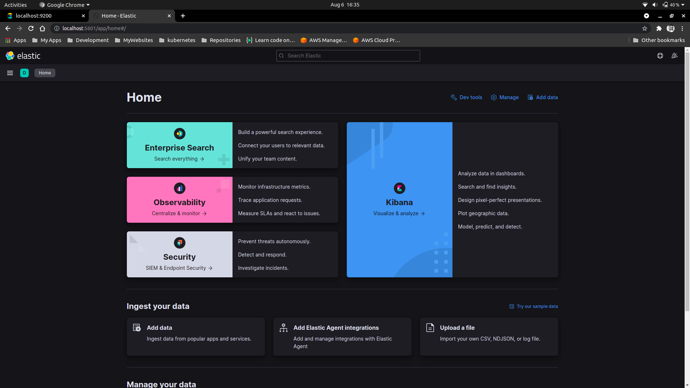
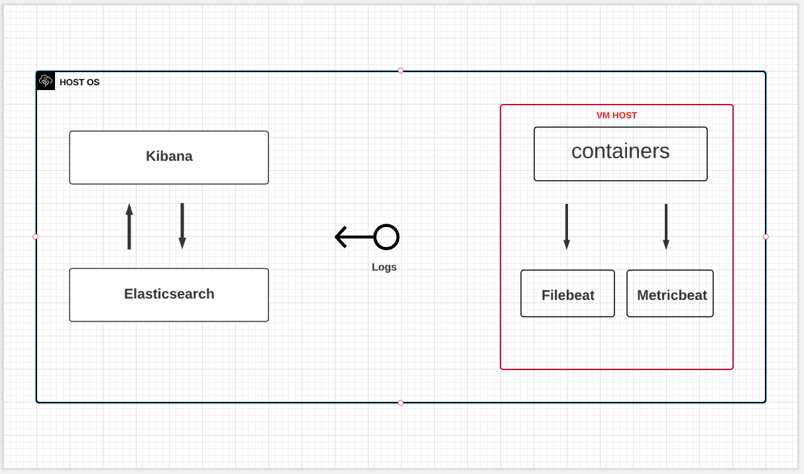

# ELK-STACK filebeat and Metricbeat

- Elasticsearch: [https://www.elastic.co/elasticsearch/](https://www.elastic.co/elasticsearch/)
- Kibana: [https://www.elastic.co/kibana/](https://www.elastic.co/kibana/)
- Filebeat: [https://www.elastic.co/guide/en/beats/filebeat/current/running-on-docker.html](https://www.elastic.co/guide/en/beats/filebeat/current/running-on-docker.html)
- Metricbeat: [https://www.elastic.co/guide/en/beats/metricbeat/current/running-on-docker.html](https://www.elastic.co/guide/en/beats/metricbeat/current/running-on-docker.html)
- Source: [https://github.com/thecyberbaby/ELK-Filebeat](https://github.com/thecyberbaby/ELK-Filebeat)

## Foreward

This documentation is meant for a rough, quick reference of all the parts needed to get up and running with
`ELK STACK` within [Docker - Coantainerized](https://www.docker.com/) environment.
The tools involved (`git`, `vagrant`, `docker`, `filebeat`, `metricbeat` etc.) are not covered in great detail.
This guide is intended to provide a starting point, and give some additional insight or considerations that may not be readily apparent about the whole process.

## Introduction to ELK STACK

The ELK stack is an acronym used to describe a stack that comprises of three popular projects: Elasticsearch, Logstash, and Kibana.
Often referred to as Elasticsearch, the ELK stack gives you the ability to aggregate logs from all your systems and applications, analyze these logs, and create visualizations for application and infrastructure monitoring, faster troubleshooting, security analytics, and more.

### Elasticsearch

Elasticsearch is a distributed search and analytics engine built on Apache Lucene. Since its release in 2010, Elasticsearch has quickly become the most popular search engine and is commonly used
for log analytics, full-text search, security intelligence, business analytics, and operational intelligence use cases.

### Logstash

Logstash is a light-weight, open-source, server-side data processing pipeline that allows you to collect data from a variety of sources, transform it on the fly, and send it to your desired destination.
It is most often used as a data pipeline for Elasticsearch, an open-source analytics and search engine.

### Kibana

Kibana is a data visualization and exploration tool used for log and time-series analytics, application monitoring, and operational intelligence use cases. It offers powerful and easy-to-use features such as histograms, line graphs,
pie charts, heat maps, and built-in geospatial support. Also, it provides tight integration with Elasticsearch, a popular analytics and search engine, which makes Kibana the default choice for visualizing data stored in Elasticsearch.

Note: We are not using Logstash as of this particular setup.

### Getting Started Guide

First we are going to write a `docker-compose.yml` file for containerizing the `elasticsearch` and `kibana` :

    mkdir elk && cd$_
    touch docker-compose.yml
    vi docker-compose.yml

feel free to use any of your favourite `code editor`.

or you can download thi file from the source:

    git clone https://github.com/thecyberbaby/ELK-stack.git

use provided `docker-compose.yml` file for provision the elasticsearch and kibana
run the docker file  :

	
	docker-compose -f docker-compose.yml up -d

	root@asus:/home/nishu/Desktop/Docker/elk# docker-compose -f docker-compose.yml up -d
	Creating network "elk_default" with the default driver
	Creating elasticsearch ... done
	Creating kibana        ... done

verify the containers are running :

	docker-compose ps

	root@asus:/home/nishu/Desktop/Docker/elk# docker-compose ps
    Name                   Command               State                         Ports                       
	-----------------------------------------------------------------------------------------------------------
	elasticsearch   /bin/tini -- /usr/local/bi ...   Up      0.0.0.0:9200->9200/tcp,:::9200->9200/tcp, 9300/tcp
	kibana          /bin/tini -- /usr/local/bi ...   Up      0.0.0.0:5601->5601/tcp,:::5601->5601/tcp          
	root@asus:/home/nishu/Desktop/Docker/elk# 

all good so far.. Notice here ports are available for kibana is `9200->9200` and for elasticse is `5601->5601`
 now visite the address in your browser as :

	`localhost`:9200 	#elasticsearch
	`localhost`:5601 	#kibana

you will get output at port `localhost:9200`  :

	{
		"name" : "elasticsearch",
		"cluster_name" : "docker-cluster",
		"cluster_uuid" : "p3hEz0A9T02iVWl5IV7hMA",
		"version" : {
	    "number" : "7.14.0",
	    "build_flavor" : "default",
	    "build_type" : "docker",
	    "build_hash" : "dd5a0a2acaa2045ff9624f3729fc8a6f40835aa1",
	    "build_date" : "2021-07-29T20:49:32.864135063Z",
	    "build_snapshot" : false,
	    "lucene_version" : "8.9.0",
	    "minimum_wire_compatibility_version" : "6.8.0",
	    "minimum_index_compatibility_version" : "6.0.0-beta1"
	    },
	"tagline" : "You Know, for Search"
	}

and at at port `localhost:5601`

 

    

Now `elasticsearch` and `kibana` are fully up and running

### Setting up filebeat and MatricBeat in Virtual Machine as client machine 

For this particular setup we'll be using `vagrant` for creating a `virtual machine` (ubuntu 16.04)

for spacific version you can check `compatiblity index - (support matrix)` by [Clicking here](https://www.elastic.co/support/matrix)

creating vagrant file :

	mkdir vagrant && cd $_
	vagrant init bento/ubuntu-16.04

	
	root@asus:/home/nishu/Desktop/Docker/elk# mkdir vagrant && cd $_
	root@asus:/home/nishu/Desktop/Docker/elk/vagrant# vagrant init bento/ubuntu-16.04
	A `Vagrantfile` has been placed in this directory. You are now
	ready to `vagrant up` your first virtual environment! Please read
	the comments in the Vagrantfile as well as documentation on
	`vagrantup.com` for more information on using Vagrant.
	root@asus:/home/nishu/Desktop/Docker/elk/vagrant# 

	//starting up VM
		
		vagrant up

	root@asus:/home/nishu/Desktop/Docker/elk/vagrant# vagrant up
	Bringing machine 'default' up with 'virtualbox' provider...
	==> default: Box 'bento/ubuntu-16.04' could not be found. Attempting to find and install...
	    default: Box Provider: virtualbox
	    default: Box Version: >= 0
	==> default: Loading metadata for box 'bento/ubuntu-16.04'
	    default: URL: https://vagrantcloud.com/bento/ubuntu-16.04
	==> default: Adding box 'bento/ubuntu-16.04' (v202104.19.0) for provider: virtualbox
	    default: Downloading: https://vagrantcloud.com/bento/boxes/ubuntu-16.04/versions/202104.19.0/providers/virtualbox.box
	==> default: Successfully added box 'bento/ubuntu-16.04' (v202104.19.0) for 'virtualbox'!
	==> default: Importing base box 'bento/ubuntu-16.04'...
	==> default: Matching MAC address for NAT networking...
	==> default: Checking if box 'bento/ubuntu-16.04' version '202104.19.0' is up to date...
	==> default: Setting the name of the VM: vagrant_default_1628250509091_38968

	//Getting into virtual machine using ssh connection
		
		vagrant ssh

	root@asus:/home/nishu/Desktop/Docker/elk/vagrant# vagrant ssh
	Welcome to Ubuntu 16.04.7 LTS (GNU/Linux 4.4.0-209-generic x86_64)

	 * Documentation:  https://help.ubuntu.com
	 * Management:     https://landscape.canonical.com
	 * Support:        https://ubuntu.com/advantage

	This system is built by the Bento project by Chef Software
	More information can be found at https://github.com/chef/bento
	vagrant@vagrant:~$ 

### So, what is actullu happening here

Unterstand the diagram 

 

    

	
Here, Kibana and elasticsearch are up and running inside the `docker containers` on the HOST MACHINE ;
filebeat and matricbeat are running inside `docker conatiners` in the VIRTUAL MACHINE; getting all the `logs` from all the `containers ` up and running on the VIRTUAL MACHINE.

Now we are good to setup `filebeat` and `metricbeat` :

we'll be following official documentation from 

 - [Filebeat](https://www.elastic.co/guide/en/beats/filebeat/current/running-on-docker.html)
 - [Metricbeat](https://www.elastic.co/guide/en/beats/metricbeat/current/running-on-docker.html)

Create a VM machine using vagrant :

 -	[Guid to vagrant](https://github.com/thecyberbaby/Vagrant)

install dockker on `VIRTUALBOX`

 -	[Guide to docker](https://docs.docker.com/engine/install/ubuntu/)

installing everything  on docker containers :

	//nginx

	docker run --name docker-nginx -p 80:80 nginx

	root@vagrant-ubuntu-trusty-64:/home/vagrant# docker run -d -p 8080:80 --name nginx nginx
	0f8b4374722057aea63710550275f66ed9bec42faf2a5fb448283c2a0b1a3645
	root@vagrant-ubuntu-trusty-64:/home/vagrant# 

	//pulling the image

	docker pull docker.elastic.co/beats/filebeat:7.14.0

	root@vagrant-ubuntu-trusty-64:/home/vagrant# docker pull docker.elastic.co/beats/filebeat:7.14.0
	7.14.0: Pulling from beats/filebeat
	Digest: sha256:299b23c421cba904d4250fda1c67791b2a3d383da9d96a6e0bbb48f40e3c659f
	Status: Image is up to date for docker.elastic.co/beats/filebeat:7.14.0
	root@vagrant-ubuntu-trusty-64:/home/vagrant# 

	//filebeat setup

	root@vagrant-ubuntu-trusty-64:/home/vagrant# docker run \
	> docker.elastic.co/beats/filebeat:7.14.0 \
	> setup -E setup.kibana.host=kibana:5601 \
	> -E output.elasticsearch.hosts=["elasticsearch:9200"] 

Notice here you have to replace the `kibana` and `elasticsearch`  with your host machine's ip address
so the logs can go to the right address :

	setup -E setup.kibana.host=yourIAddress:5601 \
	> -E output.elasticsearch.hosts=["yourIpAddress:9200"] 

	//Download example configuration file
	curl -L -O https://raw.githubusercontent.com/elastic/beats/7.14/deploy/docker/filebeat.docker.yml

edit configuration file as per your credentials `username - passwords`

	//volume mounted configuration

	docker run -d \
	  --name=filebeat \
	  --user=root \
	  --volume="$(pwd)/filebeat.docker.yml:/usr/share/filebeat/filebeat.yml:ro" \
	  --volume="/var/lib/docker/containers:/var/lib/docker/containers:ro" \
	  --volume="/var/run/docker.sock:/var/run/docker.sock:ro" \
	docker.elastic.co/beats/filebeat:7.14.0 filebeat -e -strict.perms=false \
		-E output.elasticsearch.hosts=["elasticsearch:9200"]

	 //change `elasticsearch` with Host machine's IP

Filebeat setup completed.

	//Metricbeat
	//pulling the image

	docker pull docker.elastic.co/beats/metricbeat:7.14.0

	root@vagrant-ubuntu-trusty-64:/home/vagrant# docker pull docker.elastic.co/beats/metricbeat:7.14.0
	7.14.0: Pulling from beats/metricbeat
	Digest: sha256:9fa1ab37d47a92df499e41cda9e4c84e06d0861517e9196d27411bbea6ea9a65
	Status: Image is up to date for docker.elastic.co/beats/metricbeat:7.14.0
	root@vagrant-ubuntu-trusty-64:/home/vagrant# 

	//metribeat setup

	docker run \
	docker.elastic.co/beats/metricbeat:7.14.0 \
	setup -E setup.kibana.host=kibana:5601 \
	-E output.elasticsearch.hosts=["elasticsearch:9200"]

replace these with host machine IP Address `elasticsearch` and `kibana`

	//downloading configuration file

	curl -L -O https://raw.githubusercontent.com/elastic/beats/7.14/deploy/docker/metricbeat.docker.yml

edit configuration file as per your credentials `username - passwords`

	//mounted volume configuration

	docker run -d \
	--name=metricbeat \
	--user=root \
	--volume="$(pwd)/metricbeat.docker.yml:/usr/share/metricbeat/metricbeat.yml:ro" \
	--volume="/var/run/docker.sock:/var/run/docker.sock:ro" \
	--volume="/sys/fs/cgroup:/hostfs/sys/fs/cgroup:ro" \
	--volume="/proc:/hostfs/proc:ro" \
	--volume="/:/hostfs:ro" \
	docker.elastic.co/beats/metricbeat:7.14.0 metricbeat -e \
	-E output.elasticsearch.hosts=["elasticsearch:9200"]

	 //change `elasticsearch` with Host machine's IP

Setup is completed.

### Monitoring data on Kibana

Visit to the address : `localhost:9200` //elasticesearch port
Visit to the address : `localhost:5601` //kibana port

Goto the kibana and Visite to the `Discover ` and hit `refreash`.

That's it.

